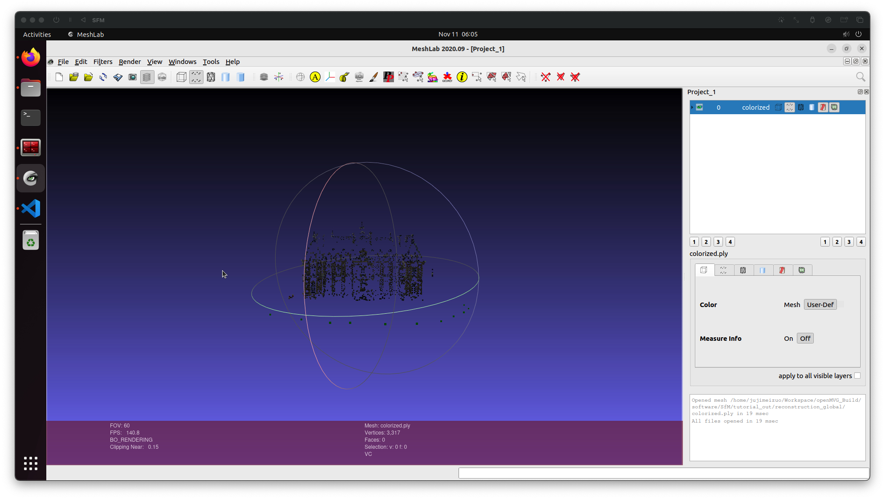
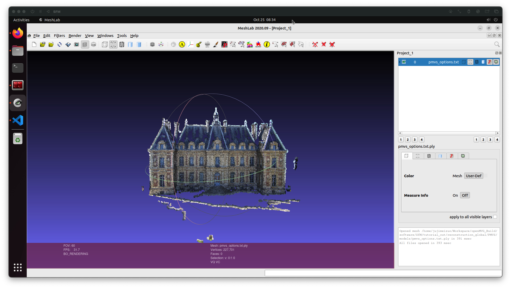

<!-- 
复现一下基于SFM的代码（理论可以参考一下B站上 北京邮电大学 鲁鹏老师的三维重建的课程），然后月底的时候会进行一次汇报。汇报内容：掌握的多视图三维重建的理论基础、基于SFM的代码复现进度（如 openMVG等，第一阶段可以不需要后端优化的内容，只要能拿着几张视图可以恢复出相机的位姿以及恢复的稀疏点云即可）。
 -->


<!-- .slide: data-background="lec1/cover.png" -->

<!--s-->
<!-- .slide: data-background="lec1/background.png" -->

<div class="middle center">
<div style="width: 100%">

# Part.1 MVG 理论基础


</div>
</div>


<!--s-->
<!-- .slide: data-background="lec1/background.png" -->

<div class="middle center">
<div style="width: 100%">

# Part.2 SFM 基础内容

</div>
</div>

<!--v-->
<!-- .slide: data-background="lec1/background.png" -->

## SFM 系统问题描述（欧式重构）

- 已知：三维场景的 m 张图像以及每张图像对应的摄像机内参数矩阵 $K_i(i=1,...,m)$
- 求解：
    - 三维场景结构，即三维场景点坐标 $X_j(j=1,...,n)$；
    - m 个摄像机的外参数 $R_i$ 及 $T_i$(i=1,...,m)


<!--v-->
<!-- .slide: data-background="lec1/background.png" -->

## SFM 系统（两视图）

- 问题
    - $x_{1j}=M_1X_j=K_1[I \ \ \ 0]X_j (j=1,...,n)$
    - $x_{2j}=M_2X_j=K_2[R \ T]X_j (j=1,...,n)$
- 求解步骤
    1. 对应点计算（SIFT 特征提取 + 近邻匹配）
    2. 求解基础矩阵 F（RANSAC + 归一化八点化）
    3. 求解本质矩阵 $E=K_2^\top F K_1$
    4. 分解本质矩阵 $E \to R$、$T \to M_2$
    5. 三角化


<!--v-->
<!-- .slide: data-background="lec1/background.png" -->

## 基于增量法的 SFM 系统（多视图）

- 求解步骤
    1. 预处理
        - 图像特征点提取与匹配
        - 基于 RANSAC 的基础矩阵或单应矩阵估计
    2. 增量法求解 SFM

<!--v-->
<!-- .slide: data-background="lec1/background.png" -->

## 增量法

- 输入：摄像机内参数、特征点和几何校验后的匹配结果
- 输出：三维点云、摄像机位姿

<hr/>

1. 计算对应点的轨迹 $(Track) \ t$
2. 计算连通图 $G$（结点代表图片，边代表其之间有足够的匹配点）
3. 在 $G$ 中选取一条边 $e$
4. 鲁棒估计 $e$ 所对应的本质矩阵 $E$
5. 分解本质矩阵 $E$，得到两张图片摄像机的位姿（外参数）
6. 三角化 $t \cap e$ 的点，作为初始化的重建结果
7. 删除 $G$ 中的边 $e$
8. 如果 $G$ 中还有边：
    1. 从 $G$ 中选取 $e$ 满足 $track(e) \cap $已重建 3D 点 最大化
    2. 用 PnP 方法估计摄像机位姿（外参数）
    3. 三角化新的 $tracks$
    4. 删除 $G$ 中的边 $e$
    5. 执行 Bundle Adjustment
9. 结束

<!--s-->
<!-- .slide: data-background="lec1/background.png" -->

<div class="middle center">
<div style="width: 100%">

# Part.3 SFM 代码复现


</div>
</div>

<!--v-->
<!-- .slide: data-background="lec1/background.png" -->

## 运行环境

- 虚拟机 Ubuntu 22.04 Arm64
- openMVG+PMVS


<!--v-->
<!-- .slide: data-background="lec1/background.png" -->

## 遇到的错误

- 错误

```CMake
/home/jujimeizuo/Workspace/openMVG/src/openMVG/system/cpu_instruction_set.hpp:18:12: fatal error: cpuid.h: No such file or directory
   18 |   #include <cpuid.h>
      |            ^~~~~~~~~
compilation terminated.
```

- 错误原因：在非 x86-64 架构的机器上，`cpuid.h` 文件不存在
- 解决方法：注释 cpuid.h 那一行和有关 `internal_cpuid` 函数的代码，并直接返回 `false`

<!--v-->
<!-- .slide: data-background="lec1/background.png" -->

## 三维重建实例（城堡）

1. OpenMVG提取稀疏点云

```bash
cd openMVG_Build/software/SfM/tutorial_demo.py
python tutorial_demo.py
```

2. PMVS重建稠密点云、重建表面和纹理映射过程

```bash
# 把openMVG生成的SfM_Data转为适用于PMVS输入格式的文件
cd tutorial_out/reconstruction_global/
openMVG_main_openMVG2PMVS -i sfm_data.bin -o ./
# 使用PMVS重建稠密点云、表面、纹理
pmvs2 ./PMVS/ pmvs_options.txt
```

3. 用 MeshLab 查看生成的点云

<!--v-->

## 稀疏点云（城堡）

<center></center>

<!--v-->

## 稠密点云（城堡）

<center></center>

<!--s-->
<!-- .slide: data-background="lec1/background.png" -->

## Reference

- [计算机视觉之三维重建（深入浅出SfM与SLAM核心算法）](https://www.bilibili.com/video/BV1DQ4y1e7x6/?spm_id_from=333.788&vd_source=5e048b202705330980eefcc9a56cc5d0)
- [使用openMVG+PMVS实现视觉三维重建](https://blog.yanjingang.com/?p=3329)

<!--s-->
<!-- .slide: data-background="lec1/background.png" -->


<div class="middle center">
<div style="width: 100%">

# 谢谢大家

<hr/>

**Question?**

</div>
</div>