<div class="middle center">
<div style="width: 100%">


# First-year Master Learning

<hr/>

1. Books
2. Papers
3. Projects

<!-- ←/→ Space Home End 翻页 -->


<div style="text-align: right; margin-top: 2em;">
<p>By冯则涛&emsp;2024.9.13&emsp;&emsp;&emsp;</p>
</div>

</div>
</div>

<!--s-->
<!-- .slide: data-background="lec2/background-books.png" -->

<div class="middle center">
<div style="width: 100%">

# 1. Books

<hr/>


- 1.1 多视图几何
- 1.2 视觉 SLAM 14 讲
- 1.3 三维数据场可视化


</div>
</div>

<!--v-->
<!-- .slide: data-background="lec2/background-books.png" -->

## 1.1 多视图几何

<!-- <center>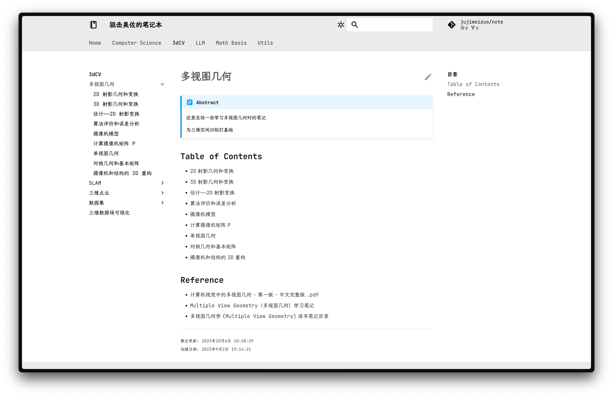</center> -->

<div class="fragment">
<div class="mul-cols">
<div class="col">


#### 1.1.1 学习程度

- 2D、3D 射影几何和变换
- 摄像机模型、如何求解摄像机参数
- 单视图几何、多视图几何
    - 对极几何
    - 基础矩阵、本质矩阵、单应矩阵
- 算法评价和误差分析

</div>

<div class="col">

<div align="center">

<a href="https://note.jujimeizuo.cn/cv/mvg/">

</a>

</div>
</div>
</div>
</div>
</div>

<div class="fragment">

#### 1.1.2 [SfM & openMVG](https://slides.jujimeizuo.cn/GroupMeetingReport/lec1/#/)

- 已知：三维场景的 m 张图像以及每张图像对应的摄像机内参数矩阵 $K_i(i=1,...,m)$
- 求解：
    - 三维场景结构，即三维场景点坐标$X_j(j=1,...,n)$；
    - m 个摄像机的外参数 $R_i$及$T_i(i=1,...,m)$
    - 结合相机内参重建稀疏点云

</div>

<!--v-->
<!-- .slide: data-background="lec2/background-books.png" -->

## 1.2 视觉 SLAM 14 讲

<div class="fragment">

#### 1.2.1 学习程度

</div>

<div class="fragment">

- 三维刚体运动（旋转矩阵、旋转向量、欧拉角、四元数、**Eigen**）
- 李群和李代数（$SO(3)$,$SE(3)$）
- 相机模型（单目、双目、RGB-D）
- 非线性优化
- 视觉里程计
    - 特征点法、特征提取和匹配、对极几何、三角测量、PnP（3D-2D）、ICP（3D-3D）
    - 直接法、光流法
- 后端优化
    - 卡尔曼滤波器
    - BA
    - 回环检测

</div>

<hr>

<div class="fragment">

#### 1.2.2 ORB-SLAM2 源码

</div>

<!--v-->
<!-- .slide: data-background="lec2/background-books.png" -->

## 1.3 三维数据场可视化

#### 1.3.1 体绘制

- 直接将三维图像的体素点通过一定的透明度叠加计算后直接对屏幕上的像素点着色。
- 特点：体数据内部更细节
- 缺点：复杂度较大


<div class="fragment">

<div class="mul-cols">
<div class="col">

- 光线投射体绘制技术

<center>
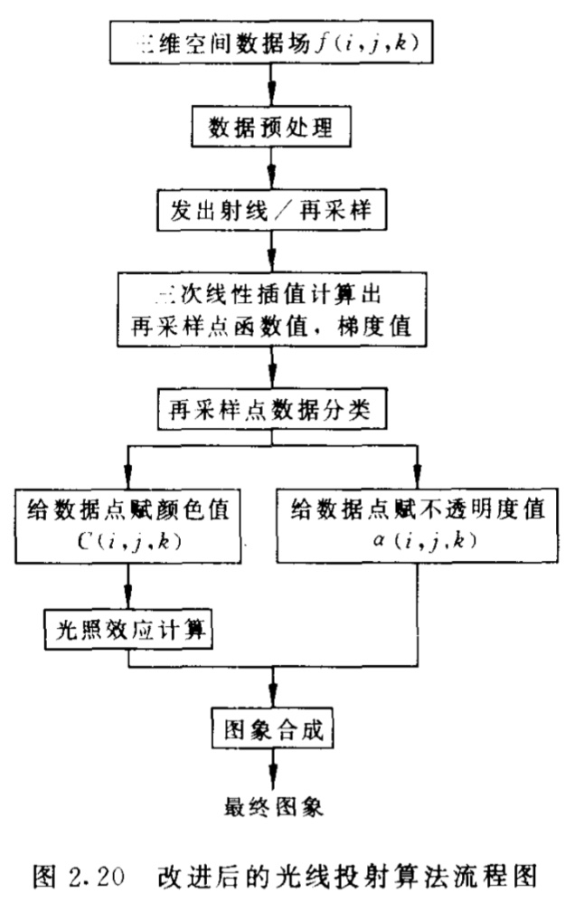
</center>

</div>

<div class="col">

- 物体空间扫描的体绘制技术

<center>
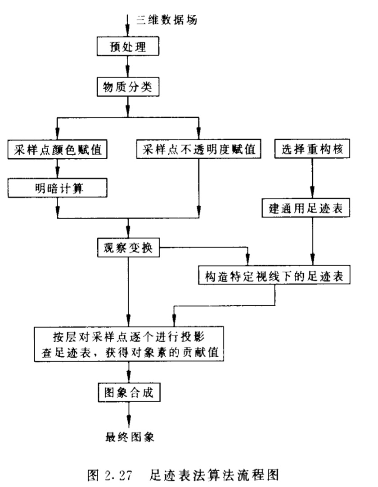
</center>

</div>

<div class="col">

- 频域体绘制技术

<center>
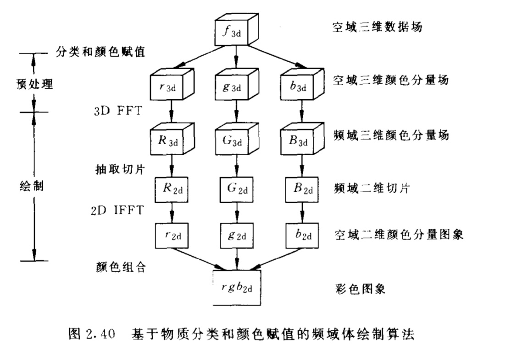
</center>

</div>

<div class="col">

<hr>

<center>
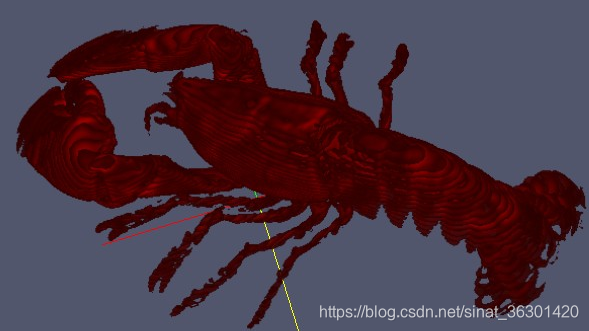
</center>

</div>


</div>

</div>

<!--v-->
<!-- .slide: data-background="lec2/background-books.png" -->

## 1.3 三维数据场可视化

#### 1.3.2 面绘制

- 想显示三维图像中的内容，可以对这个“内容”的表面建立一个三角形网格模型
- 首先建立网格模型，之后渲染网格

<hr>

<div class="fragment">

<div class="mul-cols">
<div class="col">

<hr>

- `Marching Cubes` 算法，和神经网络结合，从三维数据中提取出网格模型，并可以选择性地为网格顶点赋予颜色
- 比如在 NeRF 中使用该算法提取 mesh，实现模型的显示化


</div>

<div class="col">

<center>
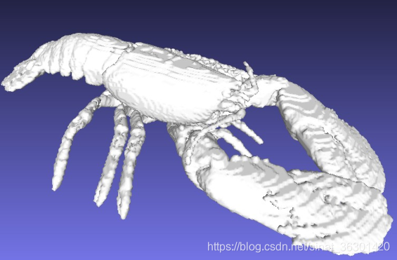
</center>

</div>

</div>

</div>

<!-- <a  href="https://note.jujimeizuo.cn/cv/3d-visualization/">
<div class="box" style="float: right; margin-right: 30px">
笔记链接
</div>
</a> -->

<!--s-->
<!-- .slide: data-background="lec2/background-papers.png" -->

<div class="middle center">
<div style="width: 100%">

# 2. Papers

<hr/>

- 2.1 动态 SLAM
- 2.2 神经隐式 SLAM

</div>
</div>

<!--v-->
<!-- .slide: data-background="lec2/background-papers-dynamicslam.png" -->

## 2.1 动态 SLAM

```text
SLAM 在静态环境中效果较好，但现实世界中大多是动态环境，存在一些问题，例如追踪、配准、
建图 ...，会直接影响最终的结果，如何解决？
```

<hr>

<div class="mul-cols">
<div class="col">

- 前端配准层面：动态点会影响配准精度
- 建图层面：最终生成的地图存在大量动态物体的“鬼影”

<div style="margin-left: 60px">

<a href="https://www.zhihu.com/question/47817909">
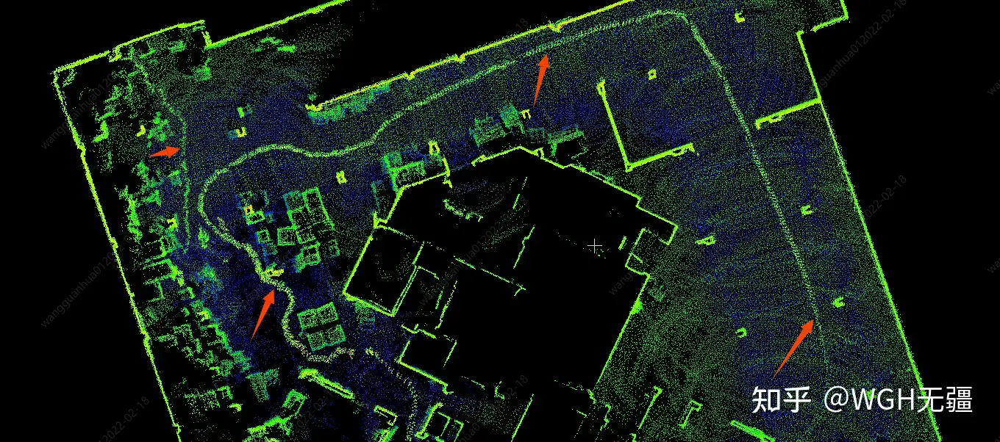
</a>

</div>
</div>

<div class="col" align="center">

- 2.1.1 动态 SLAM 综述
- 2.1.2 DynaSLAM
- 2.1.3 DS-SLAM
- 2.1.4 Detect-SLAM
- 2.1.5 Crowd-SLAM
- 2.1.6 FlowFusion
- 2.1.7 RigidFusion

</div>


</div>

<!--v-->
<!-- .slide: data-background="lec2/background-papers-dynamicslam.png" -->

## 2.1.1 动态 SLAM 综述

<div class="reference">
M. R. U. Saputra, A. Markham, and N. Trigoni, “Visual SLAM and structure from motion in dynamic environments: A survey,” ACM Computing Surveys (CSUR), vol. 51, no. 2, pp. 1–36, 2018.
</div>

<hr>

<div class="mul-cols">
<div class="col">


- 涵盖三个主要问题
    - 如何做好鲁棒 VSLAM？
    - 如何在 3D 中分割和跟踪动态物体？
    - 如何实现联合运动分割和重建？
- 两个角度看：
    1. **作为一个鲁棒性问题**：相机前的动态物体导致错误的对应关系（遮挡等），可以通过分割图像中静态和动态特征，将动态部分视为异常值来实现鲁棒性，只用静态部分计算姿态估计。
    2. **作为一个标准 VSLAM 在动态环境中的扩展**：将跟踪的特征分割成不同的簇，可以重建每个物体结构（形状）并跟踪轨迹，甚至可以将动态物体插入静态地图中。


</div>


<div class="col">
<div class="fragment">

- 大致三种思路：
    1. 排除动态特征来构建静态地图
    2. 提取动态物体而忽略静态背景
    3. 试图同时处理世界中静态和动态的组成成分

<hr>

<center>
<a href="https://blog.jujimeizuo.cn/2024/05/27/Visual-SLAM-and-SfM-in-Dynamic-Environments-A-Survey/">
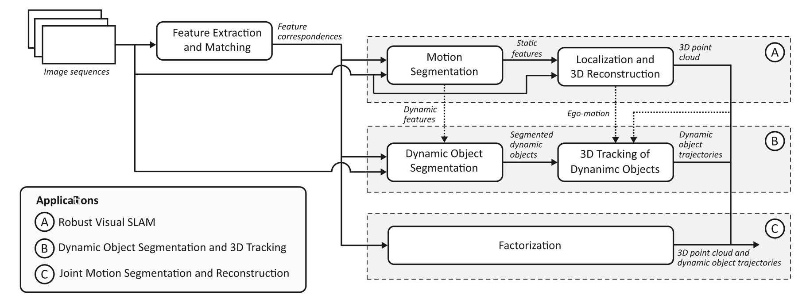
</a>
</center>

</div>
</div>


</div>


<!--v-->
<!-- .slide: data-background="lec2/background-papers-dynamicslam.png" -->

## 2.1.2 DynaSLAM

<div class="reference">
F. Bescos Berta and J. Neira, “DynaSLAM: Tracking, mapping and inpainting in dynamic environments,” IEEE RA-L, 2018.
</div>

<hr>

<div class="mul-cols">
<div class="col">

- 问题：基于特征的 SLAM 没有解决场景中场景的动态物体问题，例如行人、自行车、汽车等

<hr>

- 启发和想法：多视图几何的方法可以弥补深度学习的缺陷

</div>

<div class="col">

- 核心思想
    - 深度学习 + 多视图几何
    - 使用 Mask R-CNN 进行像素级分割，只用到语义信息
    - Mask R-CNN 只能分割出先验的动态物体，但不能找到那些“可以被移动”的物体，采用多视图几何的方法


</div>

</div>

<div align="center">
<a href="https://note.jujimeizuo.cn/cv/slam/dynaslam/">
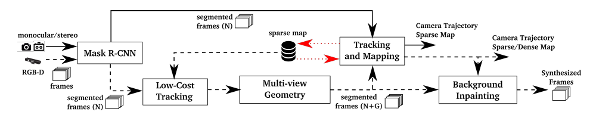
</a>
</div>

<!--v-->
<!-- .slide: data-background="lec2/background-papers-dynamicslam.png" -->

## 2.1.3 DS-SLAM

<div class="reference">
Chao Yu, Zuxin Liu, Xinjun Liu, Fugui Xie, Yi Yang, Qi Wei, Fei Qiao "DS-SLAM: A Semantic Visual SLAM towards Dynamic Environments." Published in the Proceedings of the 2018 IEEE/RSJ International Conference on Intelligent Robots and Systems (IROS 2018).
</div>


<hr>

<div class="mul-cols">

<div class="col">

- 问题：一方面，难以处理动态或粗糙的环境，另一方面，地图模型通常基于几何信息，如地标和点云地图，不提供对周围环境的高级理解

<hr>

- 启发和想法：光流法的不一致性区分静态和动态

</div>
<div class="col">

- 核心思想
    - 语义分割 + 光流处理动态物体
    - 运动一致性检验，通过计算光流的不一致性来区分静态背景和动态物体，与语义分割相结合
    - 构建了一个语义 3D 八叉树地图

</div>

</div>

<div align="center">
<a href="https://note.jujimeizuo.cn/cv/slam/ds-slam">

<div class="mul-cols">
<div class="col">

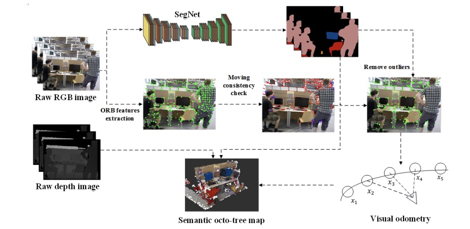

</div>

<div class="col">

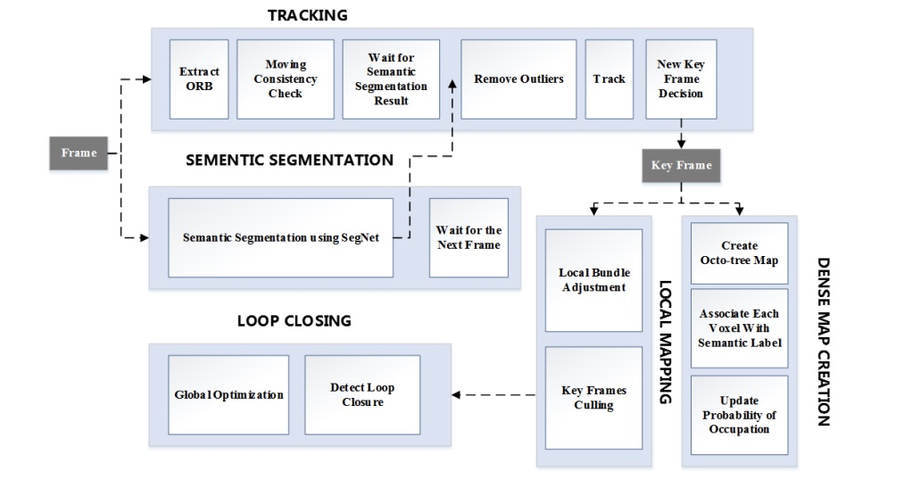

</div>
</div>

</a>
</div>


<!--v-->
<!-- .slide: data-background="lec2/background-papers-dynamicslam.png" -->

## 2.1.4 Detect-SLAM

<div class="reference">
F. Zhong, S. Wang, Z. Zhang, C. Chen, and Y. Wang, “Detect-SLAM: Making object detection and SLAM mutually beneficial,” in 2018 IEEE winter conference on applications of computer vision (WACV), 2018, pp. 1001–1010. doi: 10.1109/WACV.2018.00115.
</div>

<hr>

<div class="mul-cols">
<div class="col">

- 问题：SLAM 容易在动态环境中失败，基于图像的目标检测对变化的视点、遮挡很敏感。SLAM 和对象检测器是否可以集成到一个系统中，相互共享几何信息和语义理解？
- 核心思想
    - SLAM 和 DNN 的目标检测相结合
    - 针对语义信息的时延，提出一种实时传播每个关键点的移动概率方法
    - 如果逐帧使用目标检测，系统速度跟不上，有两种策略
        1. 仅在关键帧中做目标检测
        2. 位姿估计前，通过传播运动概率，去除动态物体上提取的特征

</div>

<div class="col" align="center" style="margin-top: 50px">

<a href="https://note.jujimeizuo.cn/cv/slam/detect-slam/">
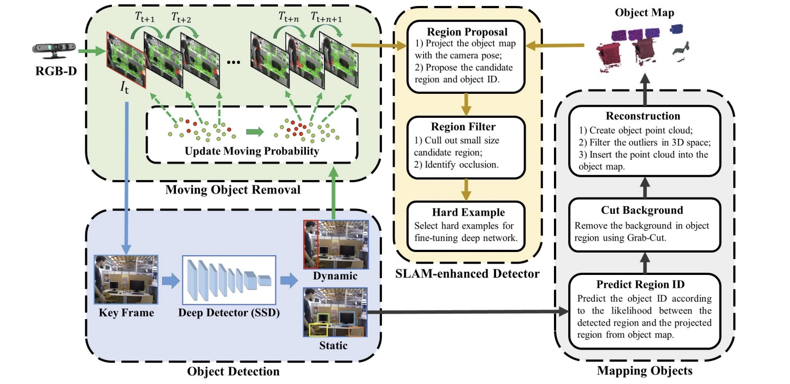
</a>
</div>

</div>


<!--v-->
<!-- .slide: data-background="lec2/background-papers-dynamicslam.png" -->

## 2.1.5 Crowd-SLAM

<div class="reference">
G. Soares J. C. V. and M. A. Meggiolaro, “Crowd-SLAM: Visual SLAM towards crowded environments using object detection,” Journal of Intelligent & Robotic Systems, vol. 102, no. 50, 2021, doi: https://doi.org/10.1007/s10846-021-01414-1.
</div>

<div class="mul-cols">
<div class="col">

<hr>

- 问题：SLAM 在拥挤人群场景的解决方案
- 核心思想
    - 动态 SLAM + 目标检测（YOLO）
    - 边界框内的关键点全部视为外点，检查过滤区域并更新特征点数量
- 缺点
    - 人物占据图像大部分区域，导致特征耗尽
    - 不过滤人之外的动态物体

</div>

<div class="col" align="center" style="margin-top: 50px">

<a href="https://note.jujimeizuo.cn/cv/slam/crowd-slam/">
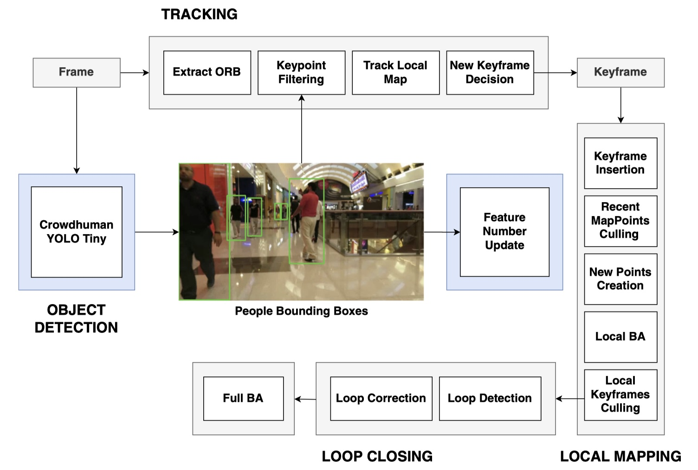
</a>

</div>
</div>


<!--v-->
<!-- .slide: data-background="lec2/background-papers-dynamicslam.png" -->

## 2.1.6 FlowFusion


<div class="reference">
T. Zhang, H. Zhang, Y. Li, Y. Nakamura, and L. Zhang, “FlowFusion: Dynamic dense RGB-d SLAM based on optical flow,” in 2020 IEEE international conference on robotics and automation (ICRA), 2020, pp. 7322–7328. doi: 10.1109/ICRA40945.2020.9197349.
</div>


<div class="mul-cols">

<div class="col">

- 问题：动态环境使得无法提取足够多的静态视觉特征，导致特征关联不足，从而导致相机位姿估计失败

<hr>

- 启发和想法
    - 场景流是一个值得借鉴的思路

</div>

<div class="col">

- 核心思想
    - PWC-net 进行稠密光流计算
    - 一种基于光流残差的动态分割和密集融合 RGB-D SLAM 方案
    - 定义光流残差为投影的 2D 场景流，即表示为动态区域
    - 由位姿、光流计算场景流（仅由物体运动产生的流）：<b style="font-size: 13px">2D scene flow = optical flow - ego flow</b>

</div>

</div>

<div align="center">
<a href="https://note.jujimeizuo.cn/cv/slam/flowfusion/">
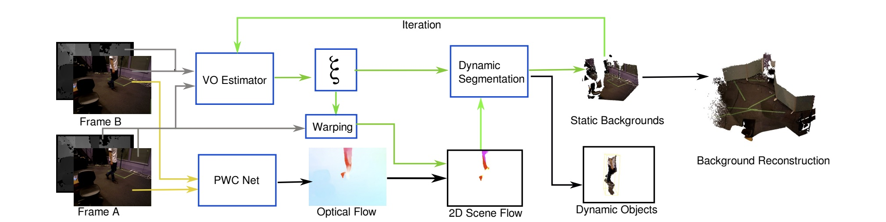
</a>
</div>

<!--v-->
<!-- .slide: data-background="lec2/background-papers-dynamicslam.png" -->

## 2.1.7 RigidFusion

<div class="reference">
R. Long, C. Rauch, T. Zhang, V. Ivan, and S. Vijayakumar, “RigidFusion: Robot localisation and mapping in environments with large dynamic rigid objects,” IEEE Robotics and Automation Letters, vol. 6, no. 2, pp. 3703–3710, Apr. 2021, doi: 10.1109/LRA.2021.3066375.
</div>

- 问题：在较大动态遮挡（超过 65%）的情况下改善定位，减少场景的模糊性
- 核心思想
    - 将动态部件视为单个刚体，利用**运动先验**分割动态部件和静态部件
    - 利用分割后的图像分别对静态部件和动态部件重建


<div align="center">
<a href="https://note.jujimeizuo.cn/cv/slam/rigidfusion/">
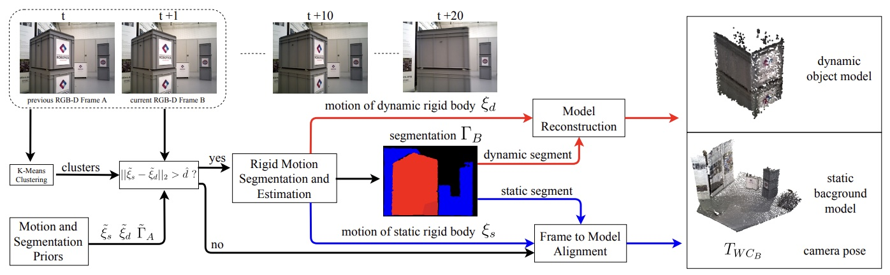
</a>
</div>

<!--v-->
<!-- .slide: data-background="lec2/background-papers-nislam.png" -->

## 2.2 神经隐式 SLAM

```text
神经隐式 SLAM 使用一个连续函数来表征图像或者三维 voxel，并用神经网络来逼近这个函数。
这种方法可以直接从图像中重建三维场景，而不需要显式的特征提取和匹配。
```

<hr>

<div class="mul-cols">
<div class="col" style="margin-left: 60px">

<a href="https://sites.cs.ucsb.edu/~lingqi/teaching/resources/GAMES101_Lecture_10.pdf">
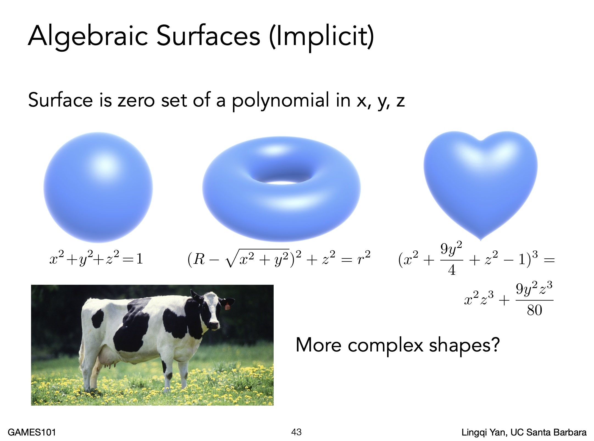
</a>

</div>

<div class="col" align="center">

- 2.2.1 NeRF
- 2.2.2 iMAP
- 2.2.3 NICE-SLAM
- 2.2.4 Co-SLAM
- 2.2.5 DDN-SLAM
- 2.2.6 NID-SLAM

</div>

</div>

<!--v-->
<!-- .slide: data-background="lec2/background-papers-nislam.png" -->

## 2.2.1 NeRF

<div class="reference">
B. Mildenhall, P. P. Srinivasan, M. Tancik, J. T. Barron, R. Ramamoorthi, and R. Ng, “NeRF: Representing scenes as neural radiance fields for view synthesis,” in ECCV, 2020.
</div>

<hr>

<div class="mul-cols">
<div class="col">

- 核心思想
    - 一种 5D 神经辐射场的方法实现隐式场景表示
    - 基于经典的体渲染的可微渲染的流程，包括一种分层采样策略
    - 一种位置编码将 5D 坐标映射到高维空间

</div>

<div class="col">

- 缺点
    - 计算量大、耗时长、不能实时
    - 只支持静态场景
    - 需要足够数量不同视角下的图像
    - 需要相机位姿


</div>


</div>

<center>

</center>

<!--v-->
<!-- .slide: data-background="lec2/background-papers-nislam.png" -->

## 2.2.2 iMAP

<div class="reference">
E. Sucar, S. Liu, J. Ortiz, and A. Davison, “iMAP: Implicit mapping and positioning in real-time,” in Proceedings of the international conference on computer vision (ICCV), 2021.
</div>

<hr>

<div class="mul-cols">
<div class="col">

- 问题：将 MLP 作为实时 SLAM 系统中的场景表示

<hr>

- 核心思想
    - 首个将隐式神经场景表示和 SLAM 结合的系统
    - 实时地逐步训练隐式场景网络
    - 关键帧选择策略和采样策略


</div>

<div class="col" align="center">

- 缺点
    - 不支持大场景
    - 收敛速度慢
    - 全局更新导致灾难性遗忘问题


<div align="right">
<a href="https://note.jujimeizuo.cn/cv/slam/imap/">
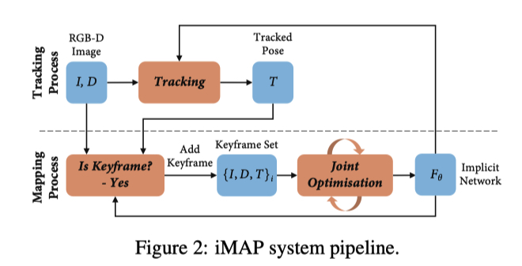
</a>
</div>

</div>


</div>


<!--v-->
<!-- .slide: data-background="lec2/background-papers-nislam.png" -->

## 2.2.3 NICE-SLAM

<div class="reference">
Z. Zhu et al., “NICE-SLAM: Neural implicit scalable encoding for SLAM,” in Proceedings of the IEEE/CVF conference on computer vision and pattern recognition (CVPR), 2022.
</div>


<div class="mul-cols">
<div class="col">

- 问题：将神经隐式 SLAM 应用到大场景中
- 核心思想
  - <u>**基于网格的多层特征**</u>
  - 采用三维栅格地图，每个栅格保存局部特征，用 decoder 将特征解码即可恢复出场景，因此即使场景面积很大也不存在网络遗忘问题
  - 对 nosie 和未观测到位置具有鲁棒性，合理预测

</div>

<div class="col">

- 缺点
    - 无法全局 BA
    - 动态场景下效果不佳
- 启发和想法
    - 动态物体的处理方法（采样得到的像素点 loss 会很大）
    - 如果能全局 BA，精度会更高（Co-SLAM）

</div>

</div>

<center>
<a href="https://note.jujimeizuo.cn/cv/slam/nice-slam/">
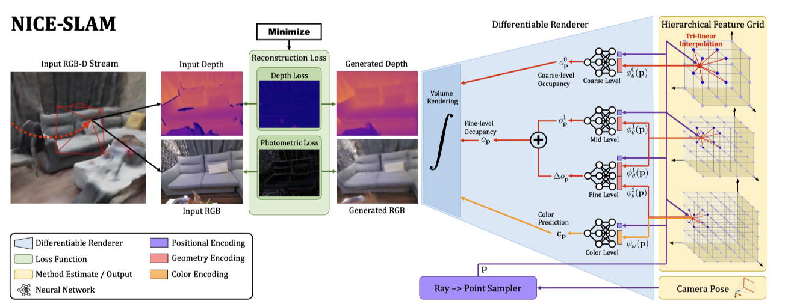
</a>
</center>


<!--v-->
<!-- .slide: data-background="lec2/background-papers-nislam.png" -->

## 2.2.4 Co-SLAM

<div class="reference">
H. Wang, J. Wang, and L. Agapito, “Co-SLAM: Joint coordinate and sparse parametric encodings for neural real-time SLAM,” in CVPR, 2023.
</div>


<div class="mul-cols">
<div class="col">

- 问题：基于坐标的网络的重建会丢失细节，过于平滑；基于参数的网络难以填补空洞，二者结合
- 核心思想
    - 将联合坐标和参数编码结合，在 hashGrid 的多分辨率特征网络表征中使用 One-blob 编码，实现空洞补全
    - <u>全局 BA，存储每个关键帧中像素子集 (5%)</u>

</div>

<div class="col" style="margin-right: 10px">

- 缺点
    - 无法应用在动态场景
- 启发和想法
    - 坐标网络和参数网络相结合，动态环境中可以填补被动态物体遮挡的区域
    - 全局 BA 的方法

</div>


</div>

<center>
<a href="https://note.jujimeizuo.cn/cv/slam/co-slam/">
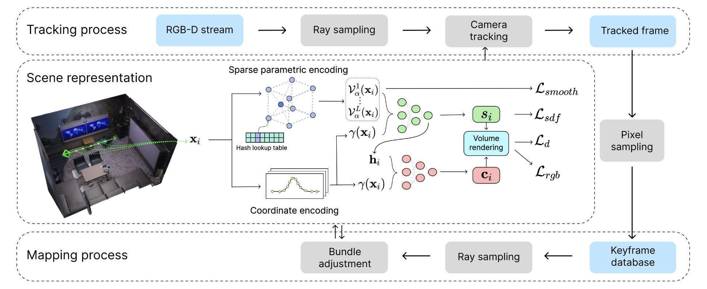
</a>
</center>

<!--v-->
<!-- .slide: data-background="lec2/background-papers-nislam.png" -->

## 2.2.5 DDN-SLAM

<div class="reference">
M. Li, J. He, G. Jiang, and H. Wang, “Ddn-slam: Real-time dense dynamic neural implicit slam with joint semantic encoding,” arXiv preprint arXiv:2401.01545, 2024.
</div>

<hr>

- 问题：神经隐式 SLAM 难以应用在动态场景、传统的动态语义 SLAM 将动态物体去除，导致空洞
- 核心思想
    - 神经隐式 + 语义 + 动态，区分前景和背景
    - 利用特征的光流区分动态掩码，进行背景恢复
    - 静态稀疏点云引导的采样策略，基于动态掩码的渲染损失


<center>
<a href="https://note.jujimeizuo.cn/cv/slam/ddn-slam/">
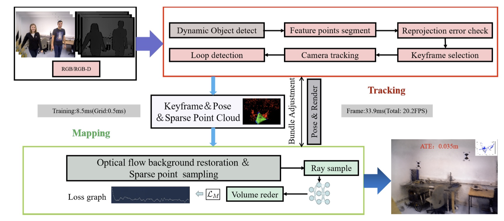
</a>
</center>

<!--v-->
<!-- .slide: data-background="lec2/background-papers-nislam.png" -->

## 2.2.6 NID-SLAM

<div class="reference">
Z. Xu, J. Niu, Q. Li, T. Ren, and C. Chen, “Nid-slam: Neural implicit representation-based rgb-d slam in dynamic environments,” arXiv preprint arXiv:2401.01189, 2024.
</div>

<hr>

- 问题：神经隐式 SLAM 难以应用在动态场景，传统的动态语义 SLAM 将动态物体去除，导致空洞
- 核心思想
    - 神经隐式 + 动态 + 语义
    - 动态物体去除：深度修正、YOLO 语义分割潜在动态物体、利用以前的视点获得的静态信息进行背景修复
    - 两种关键帧选择策略：覆盖、重叠

<center>
<a href="https://note.jujimeizuo.cn/cv/slam/nid-slam/">
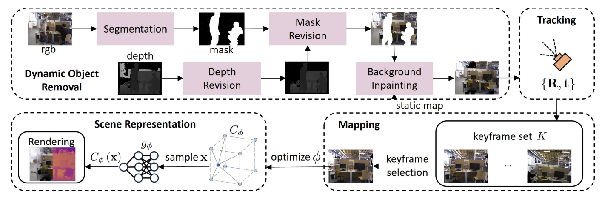
</a>
</center>


<!--s-->
<!-- .slide: data-background="lec2/background-projects.png" -->

<div class="middle center">
<div style="width: 100%">

# 3. Projects

<hr/>

- 3.1 大模型学习
- 3.2 图像编辑器

</div>
</div>


<!--v-->
<!-- .slide: data-background="lec2/background-projects.png" -->

## 3.1 大模型学习

<div class="fragment">

#### 3.1.1 学习内容

</div>

<div class="mul-cols">
<div class="col">

<div class="fragment">

- NLP
    - Word2Vec
    - RNNs
        - RNN
        - **LSTM**（可用于视频序列）
        - GRU

</div>

<hr>

<div class="fragment">

- Transformer 系列
    - Attention
    - Transformer
    - BERT（预训练 + 微调）
    - ViT

</div>
</div>

<div class="col">

<div class="fragment">

- Tools
    - Langchain
    - XTuner（微调）
    - LMDeploy（量化部署）
    - OpenCompass（测评）
    - MetaGPT（Agent）

</div>

<hr>

<div class="fragment">

<div align="center" style="font-size:15px">

<a href="https://note.jujimeizuo.cn/llm/internlm/">

</a>

</div>
</div>
</div>

<!--v-->
<!-- .slide: data-background="lec2/background-projects.png" -->

## 3.1 大模型学习

<div class="fragment">

#### 3.1.2 项目

</div>

<div class="fragment">
<div class="mul-cols">

<div class="col" style="margin-left: 50px;">
<a href="https://github.com/SmartFlowAI/EmoLLM">
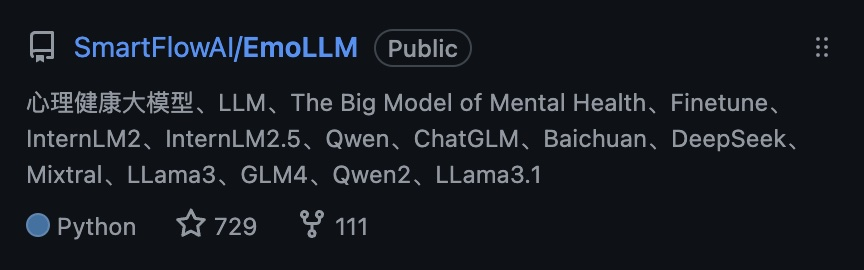
</a>

用 GLM4 为基座模型，XTuner 微调心理相关数据集

</div>

<div align="center">
<div class="col">

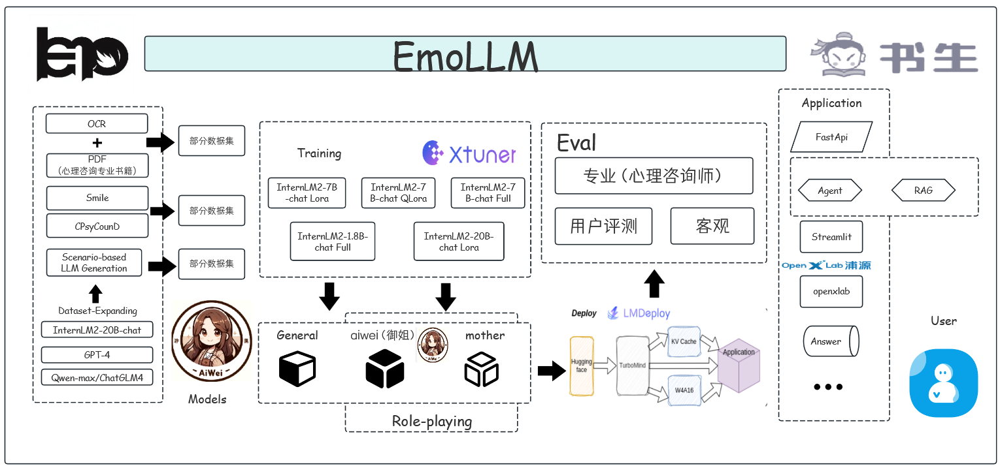

</div>
</div>
</div>
</div>

<hr>

<div class="fragment">
<div class="mul-cols">
<div class="col">

基于 MetaGPT 构建智能体应用，利用 Agent 架构得到更丰富、更定制化详细的回答

</div>

<div class="col" style="margin-right: -100px;">

<a href="https://github.com/SocialAI-tianji/Tianji">

</a>

</div>
</div>
</div>

<!--v-->
<!-- .slide: data-background="lec2/background-projects.png" -->

## 3.2 图像编辑器

<div class="fragment">

#### 3.2.1 前期调研

</div>


<div class="fragment">

- 调研开源项目，代码不能采用粘合代码调用，每个功能模块都必须有。**GIMP、minPaint、Inkscape**
- 最终选择 Inkscape 作为基础框架，进行二次开发

</div>

<div class="fragment">

- [开发文档](https://tg4663zohn.feishu.cn/docx/WLh4dOr1FoZT70x1uvWchf25nne?pre_pathname=%2Fdrive%2Fme%2F)

<div align="center">

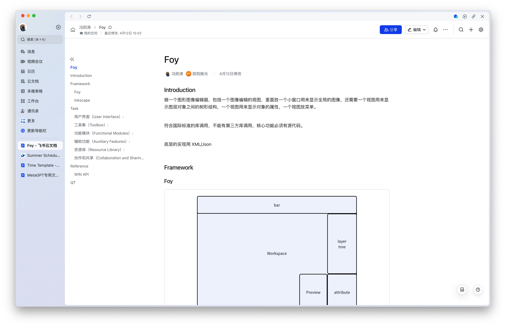

</div>
</div>

<!--v-->
<!-- .slide: data-background="lec2/background-projects.png" -->

### 3.2 图像编辑器

<div class="fragment">

#### 3.2.2 开发过程

把每个模块、每个类的作用、相互嵌套关系，都列举出来，研究。

<div align="center">

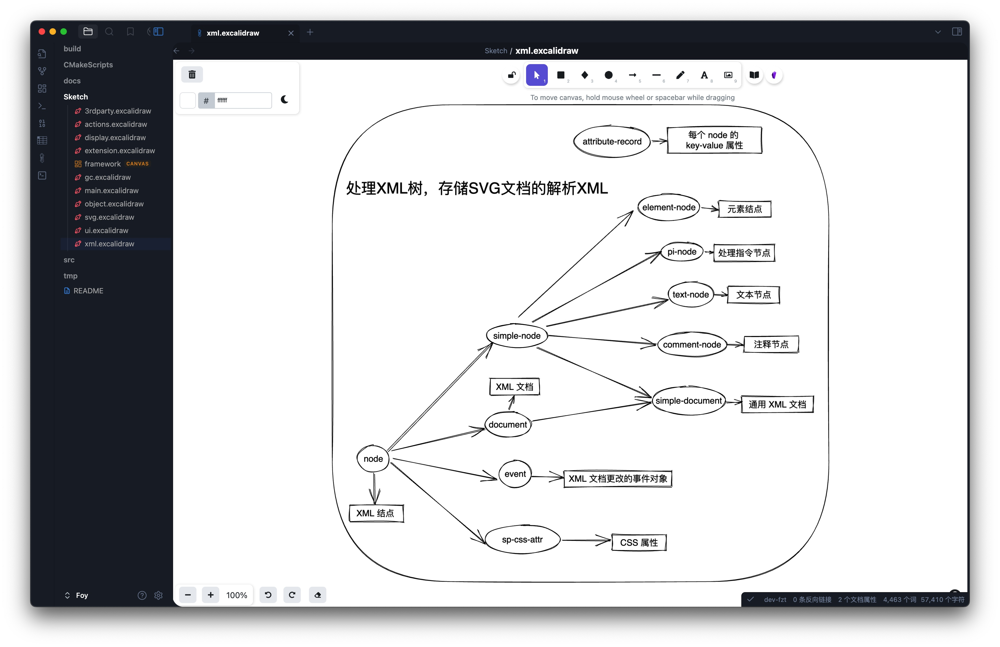

</div>
</div>

<div class="fragment">

#### 3.2.3 现场调研

去线下收集功能，并给老师们做汇报。

</div>


<!--s-->

<div class="middle center">
<div style="width: 100%">

# 谢谢大家

<hr/>

**Question?**

</div>
</div>