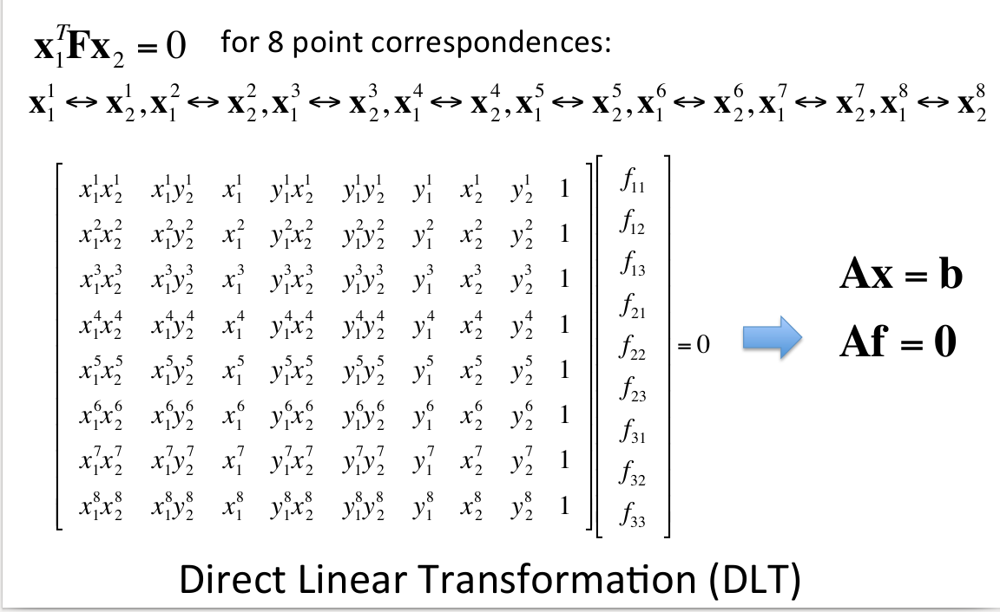
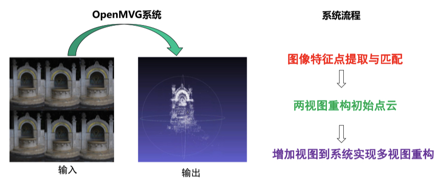

<div class="middle center">
<div style="width: 100%">


# First-year Master Learning

<hr/>

1. SFM 基础内容
2. openMVG 代码复现


<!-- ←/→ Space Home End 翻页 -->


<div style="text-align: right; margin-top: 2em;">
<p>By冯则涛&emsp;2023.11.14&emsp;&emsp;&emsp;</p>
</div>

</div>
</div>


<!--s-->
<!-- .slide: data-background="lec1/background.png" -->

<div class="middle center">
<div style="width: 100%">

# Part.1 SFM 基础内容

</div>
</div>

<!--v-->
<!-- .slide: data-background="lec1/background.png" -->

## SFM 系统问题描述


- 已知：三维场景的 m 张图像以及每张图像对应的摄像机内参数矩阵 $K_i(i=1,...,m)$
- 求解：
    - 三维场景结构，即三维场景点坐标$X_j(j=1,...,n)$；
    - m 个摄像机的外参数 $R_i$及$T_i(i=1,...,m)$
    - 结合相机内参重建稀疏点云

<center></center>

<div align="center" style="color:red; font-size:15px">
算法的关键<br>
获得两张图片中的对应点，然后估计基础矩阵F、本质矩阵E，通过SVD分解求出较好的R,t，最后将多个稀疏点云融合在一起（BA）
</div>

<!--v-->
<!-- .slide: data-background="lec1/background.png" -->


## SFM 系统（两视图）

<div class="mul-cols">
<div class="col">

- 问题
    - $x_{1j}=M_1X_j=K_1[I \ \ \ 0]{\color{Red}X_j}$
    - $x_{2j}=M_2X_j=K_2[{\color{Red}R \ T}]{\color{Red}X_j}$


</div>

<div class="col">

- 求解步骤
    1. 对应点计算（SIFT 特征提取 + 近邻匹配）
    2. 求解基础矩阵 F（RANSAC + 归一化八点法）
    3. 求解本质矩阵 $E=K_2^\top F K_1$
    4. 分解本质矩阵 $E \to R$、$T \to M_2$
    5. 三角化


</div>

</div>

<center></center>

<!--v-->
<!-- .slide: data-background="lec1/background.png" -->

## SIFT 特征提取

1. 尺度空间极值检测：搜索所有尺度上的图像位置。通过高斯微分函数来识别潜在的对于尺度和旋转不变的兴趣点。
2. 关键点定位：在每个候选的位置上，通过一个拟合精细的模型来确定位置和尺度。关键点的选择依据于它们的稳定程度。
3. 方向确定：基于图像局部的梯度方向，分配给每个关键点位置一个或多个方向。所有后面的对图像数据的操作都相对于关键点的方向、尺度和位置进行变换，从而提供对于这些变换的不变性。
4. 关键点描述：在每个关键点周围的邻域内，在选定的尺度上测量图像局部的梯度。这些梯度被变换成一种表示，这种表示允许比较大的局部形状的变形和光照变化。

<div class="mul-cols">
<div class="col">

<center></center>

</div>

<div class="col">

<center></center>

</div>

</div>


<!--v-->
<!-- .slide: data-background="lec1/background.png" -->

## 特征匹配

- 提取特征后，需要对特征进行匹配和建立track，图像对两两匹配，一般采用欧式距离：
    - 暴力匹配，对特征点穷举计算距离
    - 邻近搜索，建立kd-tree，邻域取值是关键

<div class="mul-cols">
<div class="col">

对右图中的每特征点i在左图中：

1. 找到距离其最近的特征点 $j_1$ 以及次近的特征点 $j_2$，并记录 $j_1,j_2$ 与特征点 $i$ 之间的距离为 $d_1,d_2$；
2. 计算距离比 $d_1/d_2$，如果小于某个阈值，则认为左图特征点 $i$ 与右图特征点 $j_1$ 是一对匹配点

</div>
<div class="col">

<center></center>


</div>

</div>

<!--v-->
<!-- .slide: data-background="lec1/background.png" -->

## 求解基础矩阵 F

初步初选的匹配对可能还是不靠谱的，需要用几何约束去检测。

F矩阵可以把两张图片之间的像素坐标联系起来，并包含相机的内参信息。每一个符合的匹配对像素坐标都需要满足：$x_1^\top F x_2=0$

<center></center>

<!--v-->
<!-- .slide: data-background="lec1/background.png" -->

## RANSAC 估计

求出来的F矩阵计算出有很多噪声数据，需要用RANSAC进行滤波，用归一化八点法来进行RANSAC假设，剔除不满足基础矩阵的匹配对。

<div class="mul-cols">
<div class="col">

1. 随机均匀采样八对点对
2. 基于采样的八点对，使用八点法估计基础矩阵F
3. 计算剩余点对是否满足当前点F，统计满足当前F的点的个数，作为F分数
4. 重复1-3，直到达到最大迭代次数
5. 输出分数最高的F

</div>

<div class="col">

<center></center>

</div>

</div>

<div class="mul-cols">
<div class="col">

<center></center>

</div>

<div class="col">

<center></center>

</div>

</div>


<!--v-->
<!-- .slide: data-background="lec1/background.png" -->

## 特征分解本质矩阵E

基础矩阵F和本质矩阵的关系：$E=K_2^\top F K_1$，求出E之后通过SVD分解得到R和t。


存在一个问题，给定一个本质矩阵$E=U diag(1,1,0)V^\top$和第一个相机矩阵$P_1=[I|0]$，求解第二个相机矩阵$P_2=[R|t]$，有四种解法：


<div class="mul-cols">

<div class="col">


<center></center>


</div>
<div class="col">


<center></center>

</div>

<div class="col">

<center></center>


</div>
</div>

选择$(X-C)\cdot R(3,:)^\top > 0$的对应的P2即可。这时候两幅图像的R,t均求得。

<!--v-->
<!-- .slide: data-background="lec1/background.png" -->

## 点云融合 三角化 + 捆绑调整 BA

得到R,t之后，通过三角化求解三维点$X_j$坐标。$X_j^*=\underset{X_j}{\argmin}(d(x_{1j},M_1X_j)+d(x_{2j},M_2X_j))$


上面计算出的R,t和相机内参，可以恢复出物体的稀疏点云结构
- 如果R,t是一个准确解，那么直接将各部分点云通过R,t变换到同一基准下就可以完成融合的过程
- 如果R,t仍然不准确，那么需要通过BA优化R,t，然后再进行融合

<div class="mul-cols">
<div class="col">

- BA 是一个非线性优化的过程，目的是使重建误差降到最低.
- 通过调整POSE和三维点使反向投影误差最小化。
- 如果相机没有标定，还应该将焦距也参与平差。

</div>

<div class="col">

<center></center>

</div>

</div>


多幅图像的计算方法，依次迭代上面的流程，求得比较准确的R,t后，即可进行点云的融合，到此完成稀疏点云的重建过程。

<!--v-->
<!-- .slide: data-background="lec1/background.png" -->

## 基于增量法的 SFM 系统（多视图）


<center></center>

<!--v-->
<!-- .slide: data-background="lec1/background.png" -->

## 增量法


- 输入：摄像机内参数、特征点和几何校验后的匹配结果
- 输出：三维点云、摄像机位姿

<hr/>


<div class="mul-cols">
<div class="col">

1. 计算对应点的轨迹 $(Track) \ t$
2. 计算连通图 $G$（结点代表图片，边代表其之间有足够的匹配点）
3. 在 $G$ 中选取一条边 $e$
4. 鲁棒估计 $e$ 所对应的本质矩阵 $E$
5. 分解本质矩阵 $E$，得到两张图片摄像机的位姿（外参数）
6. 三角化 $t \cap e$ 的点，作为初始化的重建结果
7. 删除 $G$ 中的边 $e$

</div>

<div class="col">

8. 如果 $G$ 中还有边：
    1. 从 $G$ 中选取 $e$ 满足 $track(e) \cap $已重建 3D 点 最大化
    2. 用 PnP 方法估计摄像机位姿（外参数）
    3. 三角化新的 $tracks$
    4. 删除 $G$ 中的边 $e$
    5. 执行 Bundle Adjustment
9. 结束


</div>


<!--s-->
<!-- .slide: data-background="lec1/background.png" -->

<div class="middle center">
<div style="width: 100%">

# Part.2 openMVG 代码复现


</div>
</div>


<!--v-->
<!-- .slide: data-background="lec1/background.png" -->

## 遇到的错误

- 错误

```CMake
/home/jujimeizuo/Workspace/openMVG/src/openMVG/system/cpu_instruction_set.hpp:18:12: fatal error: cpuid.h: No such file or directory
   18 |   #include <cpuid.h>
      |            ^~~~~~~~~
compilation terminated.
```

- 错误原因：在非 x86-64 架构的机器上，`cpuid.h` 文件不存在
- 解决方法：注释 cpuid.h 那一行和有关 `internal_cpuid` 函数的代码，并直接返回 `false`

<div class="fragment">

<center></center>

</div>

<!--v-->

## 三维重建实例（城堡）

<center>
<video src="lec1/sparse-point-cloud.mov" controls>
  alt="稠密点云"
</video>
</center>

<!--s-->
<!-- .slide: data-background="lec1/background.png" -->

## Reference

- 多视图几何
- [计算机视觉之三维重建（深入浅出SfM与SLAM核心算法）](https://www.bilibili.com/video/BV1DQ4y1e7x6/?spm_id_from=333.788&vd_source=5e048b202705330980eefcc9a56cc5d0)
- [使用openMVG+PMVS实现视觉三维重建](https://blog.yanjingang.com/?p=3329)
- [SFM算法原理初简介](https://jiajiewu.gitee.io/post/tech/slam-sfm/sfm-intro/)
- [sift算法原理](https://blog.csdn.net/u010440456/article/details/81483145)

<!--s-->


<div class="middle center">
<div style="width: 100%">

# 谢谢大家

<hr/>

**Question?**

</div>
</div>